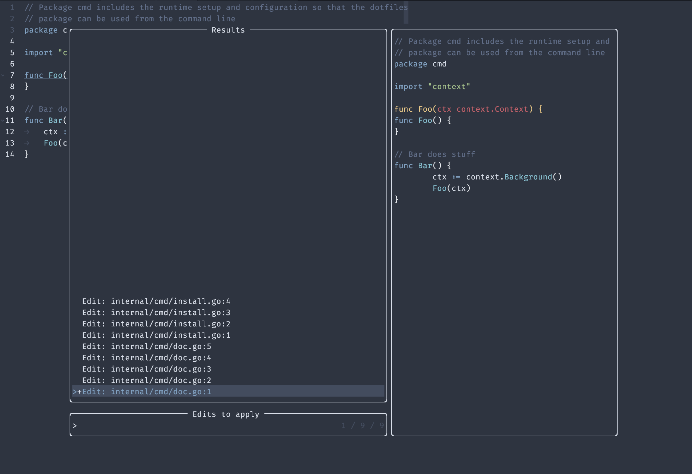

# LSP-Preview.nvim

A plugin that allows previewing of all changes done to a workspace before
applying.



## Note

This plugin affects all workspace edits coming from the language server.
Not all are currently supported, if you run into problems with other methods,
please let me know.

## Installation

lazy.nvim:

```lua
{
  'jan-xyz/lsp-preview.nvim',
  version = "*",
  opts = {},
  dependencies = {
   "nvim-telescope/telescope.nvim",
   "nvim-lua/plenary.nvim",
  {
    "echasnovski/mini.nvim",
    config = function()
     require("mini.diff").setup({})
    end,
    },
  },
}
```

```lua
 -- Rename
  vim.keymap.set("n", "<leader>r", require("lsp-preview").rename,
   { noremap = true, buffer = bufnr, desc = "Rename symbol" })
  vim.keymap.set("n", "<leader>R", require("lsp-preview").rename_preview,
   { noremap = true, buffer = bufnr, desc = "Rename symbol (preview)" })

 -- Code Action
  vim.keymap.set({ "n", "v" }, "<leader>a", require("lsp-preview").code_action,
   { noremap = true, buffer = bufnr, desc = "Perform code action" }
  )
  vim.keymap.set({ "n", "v" }, "<leader>A", require("lsp-preview").code_action_preview,
   { noremap = true, buffer = bufnr, desc = "Perform code action (preview)" }
  )
```

## Configuration

If you're fine with the defaults, you're good to go after installation. If you
want to tweak, call this function:

```lua
require("lsp-preview").setup({
 --Automatically apply code-actions if there is only 1 available.
 apply = true,
 --Preview all changes per default.
 preview = false,
})
```

## Usage

The picker comes pre-selected with all changes.

| mapping | description |
|----|----|
| `<cr>` | accept selection and apply|
| `<tab>` | toggle selection on current item and move to next |
| `<s-tab>` | toggle selection on current item and move to previous |
| `<c-a>` | toggle all selections |

## Inspired by

* The implementation of the diffs and the telescope picker are heavily inspired
  by [azsnhe21/actions-preview.nvim](https://github.com/aznhe21/actions-preview.nvim).
  Without the prework done there, I would not have been able to build this.
* The idea to overwrite a built-in function came from [stevearc/dressing.nvim](https://github.com/stevearc/dressing.nvim)
